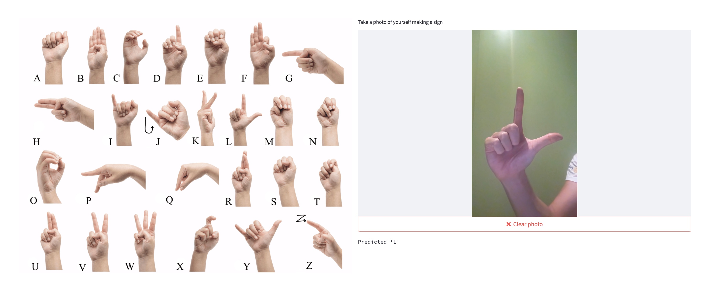

# swordle-streamlit-ui

This is a simple streamlit ui that was developed to help with testing of the
Swordle backend, the main product UI is available at [swordle.dev](https://swordle.dev)
with code available at [swordle-ui](https://github.com/cpsnowden/swordle-ui).

This UI enables someone to take a screenshot which is passed to the SWordle
backend to predict the ASL letter that is being signed e.g:



A live version of this UI can be found [here](https://cpsnowden-swordle-streamlit-ui-home-j35s5t.streamlit.app)

## Development

### Install the application

```
pyenv virtualenv swordle-streamlit-ui
pyenv activate swordle-streamlit-ui
pyenv local swordle-streamlit-ui

make install
```

### Run the application

#### Against Local API

```bash
make run_local
```

#### Against Production API

```bash
make run
```
